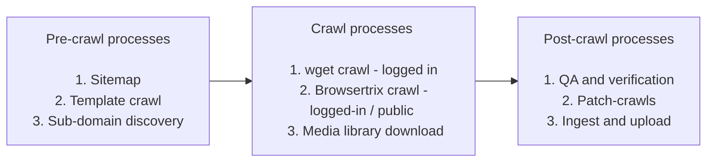

# Web Archiving Process Overview

This page outlines a full web capture of ICAEW.com crawl (logged-in / public) but the general process should apply to most other websites.

## High-level overview



### [Preservica folder structure](#preservica-folder-structure)


The following shows an example of a complete crawl within Preservica. Web crawls should follow this structure. All items should be closed with the exception of the .wacz file.

```bash
20241128-ICAEW-com-logged-in/
├── 20241128-ICAEW-com-logged-in.wacz
├── 20241128-ICAEW-com-logged-in-wget.zip
├── 20241128-ICAEW-com-media-library.zip
├── crawl-metadata/
│   ├── 20241128_sitemap_.txt (Mandatory)
│   ├── matching_urls_20241128_145826.csv (Optional)
│   ├── missing_urls_20241128_145826.csv (Optional)
│   ├── non_200_urls_20241128_145826.csv (Optional)
│   ├── notes.txt (Optional)
```

## Process Overview

### Pre-crawl processes

#### 1) Sitemap

Save a copy of the ICAEW sitemap for:

- Input to the web crawlers
- Post-crawl validation
- Content reference

Use [sitemap_xml_to_txt_or_html.py](https://github.com/icaew-digital-archive/digital-archiving-scripts/blob/main/sitemap%20tools/sitemap_xml_to_txt_or_html.py) with the following arguments:

```bash
# Example command to convert sitemaps to text format
python3 sitemap_xml_to_txt_or_html.py \
    --to_file 202XXXXX_sitemap.txt \
    https://www.icaew.com/sitemap_corporate.xml \
    https://www.icaew.com/sitemap_careers.xml \
    --exclude_strings "sprint-test-pages" "active-members"
```

#### 2) Request a list of templates and do a template crawl

Before running a full crawl, it's important to test how the crawler handles various templates and elements on the site - especially new ones. This helps identify potential issues with capture and playback.

- Request any new additional templates be added to this document: [Sitecore templates and examples ](https://icaew.sharepoint.com/:w:/s/digitalarchive/EY-WRGmke3VGmyYkTdEDDYMBfZ5nyLgefubtdJNa4WMfDQ?e=CMGN8D&CID=db808ef5-54c9-52fb-079f-87384e3ca7aa&ovuser=30a7efd6-7f05-437d-bc19-e7c6df3892f1%2CCraig.McCarthy%40icaew.com&clickparams=eyJBcHBOYW1lIjoiVGVhbXMtRGVza3RvcCIsIkFwcFZlcnNpb24iOiIxNDE1LzI1MDMwMjAxMDEwIiwiSGFzRmVkZXJhdGVkVXNlciI6ZmFsc2V9)

- Complete a template crawl

    - This is covered on the Browsertrix page [here](../web-archiving/browsertrix.md).
    - OPTIONAL: At this point it might warrant investigating the writing of custom behaviors for the web crawler if any problematic elements are identified. This is outlined further [here](../web-archiving/browsertrix-behaviors.md).


#### 3) Sub-domain discovery

OPTIONAL: An optional step can be to use the [crt-scraper.py](https://github.com/icaew-digital-archive/digital-archiving-scripts/blob/main/web%20crawling/crt-scraper.py) script to look for new sub-domains that may or may not be included in a full ICAEW.com capture.

### Crawl processes:

#### 1) Media library download

Prerequisites:

- Access to the VDI
- Sitecore login credentials (available on the Logins page)

Steps:

1. Log into the Sitecore backend
2. Navigate to the "Media Library"
3. Right-click the root level folder ("Media Library")
4. Select "Scripts" and then "Download"

Notes:

- The download process may take several hours
- The resulting zip file can be upwards of 10 GB
- Only media stored directly in Sitecore will be downloaded. External media (e.g., Vimeo, StreamAMG) will not be included


#### 2) wget crawl

- This is covered on the wget page [here](../web-archiving/wget.md).

#### 3) Browsertrix - logged-in / public crawls

- This is covered on the Browsertrix page [here](../web-archiving/browsertrix.md).

### Post-crawl processes:


#### 1) Quality Assurance and Verification

- These processes are covered on the wget page [here](../web-archiving/wget.md) and on the Browsertrix page [here](../web-archiving/browsertrix.md).


#### 2) Ingest to Preservica

- Upload to Preservica using the [AWS client](../preservica/aws-cli.md), replicate the [Preservica folder structure](#preservica-folder-structure) as noted above.

- After ingest ensure fixity values match with    

      ```bash
      sha1sum [FILE]
      ```

- Check playback of the WACZ file works in Preservica's UA.   

#### 3) Upload public ICAEW.com capture to Archive-It

- TODO

#### 4) Documentation (ICAEW Digital Archive Sharepoint)

- Update the [ICAEW platform register](https://icaew.sharepoint.com/:x:/r/sites/digitalarchive/_layouts/15/Doc.aspx?sourcedoc=%7B17C4654A-615F-4E26-8FF9-B309DEB01339%7D&file=ICAEW%20platform%20register.xlsx&action=default&mobileredirect=true) document with the latest capture dates.